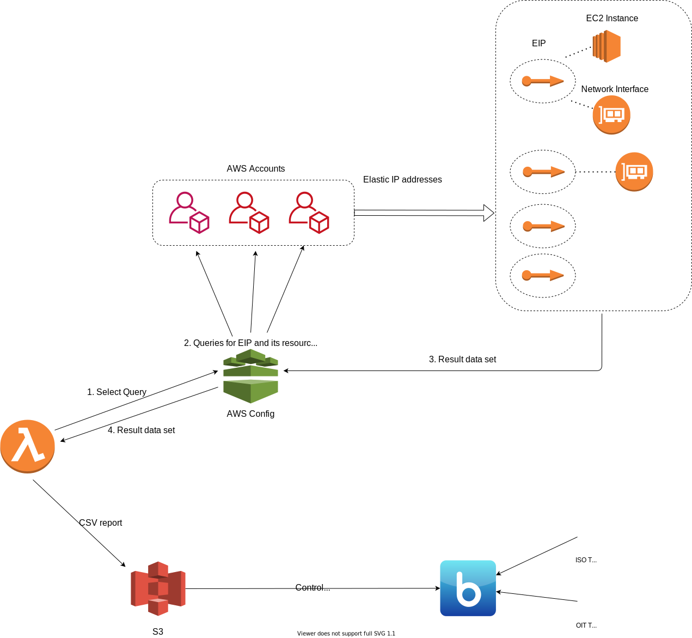

# AWS EIP List

## Overview
The purpose of this code is to list all EIPs(Elastic IP addresses) used in all AWS accounts via a lambda script that queries data from AWS config. The output CSV report listing all resources, tags, and parameters attached to the EIPs facilitates any investigations from the Security team reducing the manual effort to search for the EIP and its resource links manually.

## AWS Config
AWS config gives us the ability to execute SQL-like queries in the advanced queries option. The aggregator option allows queries over various accounts in AWS.

References:
<a href="https://docs.aws.amazon.com/config/latest/developerguide/querying-AWS-resources.html">AWS Config Advanced Queries</a>
<a href="https://docs.aws.amazon.com/config/latest/developerguide/query-components.html">AWS Query Components</a>

## Lambda permissions
The code for this function is written in Python 3.8 and uses standard python json and boto3 libraries for processing.
The lambda function must have a role attached with the following permissions added to its policy:

AWS config Read permissions (SelectAggregateResourceConfig)
S3 Write permissions (PutObject)
Cloudwatch Logs default Write permissions

